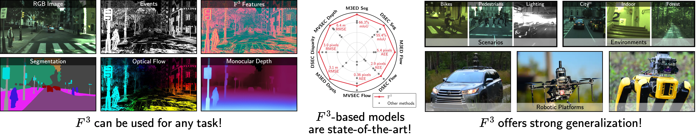
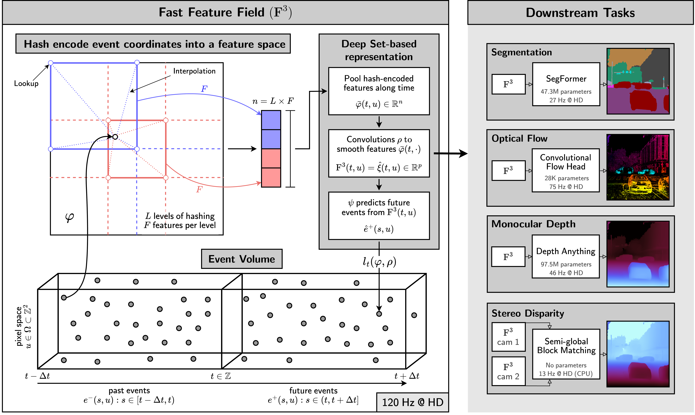

# Fast Feature Field (F<sup>3</sup>): A Predictive Representation of Events

*Official repository for the paper [Fast Feature Field (F<sup>3</sup>): A Predictive Representation of Events](https://arxiv.org/abs/2509.25146).*

<div align="center">



[Richeek Das](https://www.seas.upenn.edu/~richeek/), [Kostas Daniilidis](https://www.cis.upenn.edu/~kostas/), [Pratik Chaudhari](https://pratikac.github.io/)

*GRASP Laboratory, University of Pennsylvania*

[[📜 Paper](https://arxiv.org/abs/2509.25146)] • [[🎬 Video](https://youtu.be/DFwz8JeqDk0)] • [[🌐 Website](https://www.seas.upenn.edu/~richeek/f3/)] • [[📖 BibTeX](#citation)]

</div>

## Overview

F<sup>3</sup> is a predictive representation of events. It is a statistic of past events, sufficient to predict future events. We prove that such a representation retains information about the structure and motion in the scene. F<sup>3</sup> architecture is designed specifically for high-performance processing of events. F<sup>3</sup> achieves low-latency computation by exploiting the sparsity of event data using a multi-resolution hash encoder and permutation-invariant architecture. Our implementation can compute F<sup>3</sup> at 120 Hz and 440 Hz at HD and VGA resolutions, respectively, and can predict different downstream tasks at 25-75 Hz at HD resolution. These HD inference rates are roughly 2-5 times faster than the current state-of-the-art event-based methods. Please refer to the [paper](https://arxiv.org/abs/2509.25146) for more details.


<div align="center">



*An overview of the neural architecture for Fast Feature Field (F<sup>3</sup>) and its downstream variants.*

</div>


## Quickstart

### Installation

See "Using F<sup>3</sup> with `torch.hub`" below for a quick way to load F<sup>3</sup> models for inference without cloning the repository. If you want to train F<sup>3</sup> models or use the codebase for your own tasks, please install F<sup>3</sup> locally by following the instructions below.

```bash
conda create -n f3 python=3.11
conda activate f3
```

Install F<sup>3</sup> locally:

```bash
git clone git@github.com:grasp-lyrl/fast-feature-fields.git
cd fast-feature-fields
pip install -e .
```

### Inference using pretrained F<sup>3</sup> and its downstream variants [`[minimal.ipynb]`](minimal.ipynb)

To get you up and running quickly, we can download a small sequence from M3ED and run some inference tasks on it with pretrained weights. Head over to [`[minimal.ipynb]`](minimal.ipynb) to explore the inference pipeline for F<sup>3</sup> and its downstream variants. This is the **recommended** way to get started. You can also load pretrained F<sup>3</sup> models using `torch.hub` as shown below.

#### Using F<sup>3</sup> with `torch.hub`

You can directly load pretrained F<sup>3</sup> models using PyTorch Hub without cloning the repository:

```python
import torch
model = torch.hub.load('grasp-lyrl/fast-feature-fields', 'f3',
                      name='1280x720x20_patchff_ds1_small', 
                      pretrained=True, return_feat=True, return_logits=False)
```

The `name` parameter can be replaced with any of the configuration names available under `confs/ff/modeloptions/` (without the `.yml` extension).


### Training an F<sup>3</sup>


Please refer to [`data/README.md`](data/README.md) for detailed instructions on setting up the datasets. This is important if you want to train F<sup>3</sup> models on the M3ED, DSEC or MVSEC datasets. As an example, we show how to train an F<sup>3</sup> model on the car urban daytime driving sequences of M3ED below. You can run the following command after setting up the `car urban` sequences of M3ED as per the instructions in [`data/README.md`](data/README.md):

```bash
accelerate launch --config_file confs/accelerate_confs/2GPU.yml main.py\
                  --conf confs/ff/trainoptions/patchff_fullcardaym3ed_small_20ms.yml\
                  --compile
```

### Training downstream tasks using F<sup>3</sup>

- Coming soon!


### Using F<sup>3</sup> as a pretrained backbone for your task

- Coming soon!

---

### Citation

If you find this code useful in your research, please consider citing:

```bibtex
@misc{das2025fastfeaturefield,
  title={Fast Feature Field ($\text{F}^3$): A Predictive Representation of Events}, 
  author={Richeek Das and Kostas Daniilidis and Pratik Chaudhari},
  year={2025},
  eprint={2509.25146},
  archivePrefix={arXiv},
  primaryClass={cs.CV},
  url={https://arxiv.org/abs/2509.25146},
}
```

### Issues

If you encounter any issues, please open an issue on the [GitHub Issues page](https://github.com/grasp-lyrl/fast-feature-fields/issues) or contact [`sudoRicheek`](https://www.github.com/sudoRicheek)

