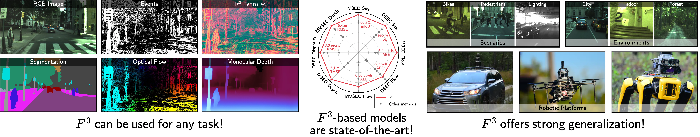
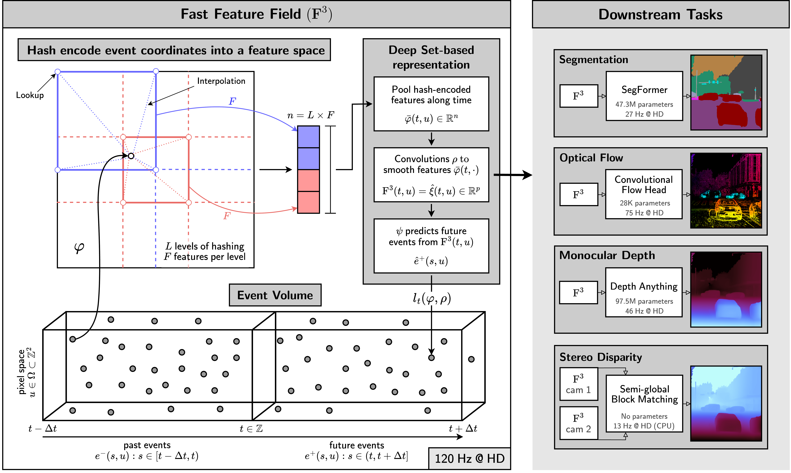

# Fast Feature Field (F<sup>3</sup>): A Predictive Representation of Events

*Official repository for the paper [Fast Feature Field (F<sup>3</sup>): A Predictive Representation of Events](https://arxiv.org/abs/2509.25146).*

<div align="center">



[Richeek Das](https://www.seas.upenn.edu/~richeek/), [Kostas Daniilidis](https://www.cis.upenn.edu/~kostas/), [Pratik Chaudhari](https://pratikac.github.io/)

*GRASP Laboratory, University of Pennsylvania*

[[📜 Paper](https://arxiv.org/abs/2509.25146)] • [[🎬 Video](https://youtu.be/DFwz8JeqDk0)] • [[🌐 Website](https://www.seas.upenn.edu/~richeek/f3/)] • [[📖 BibTeX](#citation)]

</div>

## Overview

F<sup>3</sup> is a predictive representation of events. It is a statistic of past events, sufficient to predict future events. We prove that such a representation retains information about the structure and motion in the scene. F<sup>3</sup> architecture is designed specifically for high-performance processing of events. F<sup>3</sup> achieves low-latency computation by exploiting the sparsity of event data using a multi-resolution hash encoder and permutation-invariant architecture. Our implementation can compute F<sup>3</sup> at 120 Hz and 440 Hz at HD and VGA resolutions, respectively, and can predict different downstream tasks at 25-75 Hz at HD resolution. These HD inference rates are roughly 2-5 times faster than the current state-of-the-art event-based methods. Please refer to the [paper](https://arxiv.org/abs/2509.25146) for more details.


<div align="center">



*An overview of the neural architecture for Fast Feature Field (F<sup>3</sup>) and its downstream variants.*

</div>


## Quickstart

### Installation

See "Using F<sup>3</sup> with `torch.hub`" below for a quick way to load F<sup>3</sup> models for inference without cloning the repository. If you want to train F<sup>3</sup> models or use the codebase for your own tasks, please install F<sup>3</sup> locally by following the instructions below.

```bash
conda create -n f3 python=3.11
conda activate f3
```

Install F<sup>3</sup> locally:

```bash
git clone git@github.com:grasp-lyrl/fast-feature-fields.git
cd fast-feature-fields
pip install -e .
```

### Inference using pretrained F<sup>3</sup> and its downstream variants [`[minimal.ipynb]`](minimal.ipynb)

To get you up and running quickly, we can download a small sequence from M3ED and run some inference tasks on it with pretrained weights. Head over to [`[minimal.ipynb]`](minimal.ipynb) to explore the inference pipeline for F<sup>3</sup> and its downstream variants. This is the **recommended** way to get started. You can also load pretrained F<sup>3</sup> models using `torch.hub` as shown below.

#### Using F<sup>3</sup> with `torch.hub`

You can directly load pretrained F<sup>3</sup> models using PyTorch Hub without cloning the repository:

```python
import torch
model = torch.hub.load('grasp-lyrl/fast-feature-fields', 'f3',
                      name='1280x720x20_patchff_ds1_small', 
                      pretrained=True, return_feat=True, return_logits=False)
```

The `name` parameter can be replaced with any of the configuration names available under `confs/ff/modeloptions/` (without the `.yml` extension).


### Training an F<sup>3</sup>


Please refer to [`data/README.md`](data/README.md) for detailed instructions on setting up the datasets. This is important if you want to train F<sup>3</sup> models on the M3ED, DSEC or MVSEC datasets. As an example, we show how to train an F<sup>3</sup> model on the car urban daytime driving sequences of M3ED below. You can run the following command after setting up the `car urban` sequences of M3ED as per the instructions in [`data/README.md`](data/README.md):

```bash
accelerate launch --config_file confs/accelerate_confs/2GPU.yml main.py\
                  --conf confs/ff/trainoptions/patchff_fullcardaym3ed_small_20ms.yml\
                  --compile
```

### Training downstream tasks using F<sup>3</sup>

We provide training scripts and pretrained models for multiple downstream tasks. Each task has its own detailed README:

- **Monocular Depth Estimation**: See [`src/f3/tasks/depth/README.md`](src/f3/tasks/depth/README.md)

- **Optical Flow Estimation**: See [`src/f3/tasks/optical_flow/README.md`](src/f3/tasks/optical_flow/README.md)

- **Semantic Segmentation**: See [`src/f3/tasks/segmentation/README.md`](src/f3/tasks/segmentation/README.md)

### Using F<sup>3</sup> as a pretrained backbone for your task

F<sup>3</sup> can be easily integrated as a feature extractor for your custom tasks. The model outputs dense feature representations that can be fed to task-specific decoders. More instructions coming soon!


## AOTI PT2 Export for Deployment

For high-performance deployment on edge devices (e.g., NVIDIA Jetson) or in C++ applications, F<sup>3</sup> and its downstream models can be exported to PyTorch 2.x AOTI (Ahead-Of-Time Inductor) `.pt2` format. This enables:
- Inference without Python dependencies
- Reduced latency and memory footprint
- Easy integration with ROS2 and C++ pipelines

See [`_aoti_pt2/README.md`](_aoti_pt2/README.md) for detailed export and deployment instructions.

### Inference Speed Comparison

| Platform | Resolution | F<sup>3</sup> | F<sup>3</sup> + Depth | F<sup>3</sup> + Flow |
|----------|------------|---------------|------------------------|----------------------|
| Desktop RTX 4090 | 1280x720 | 2.23 ms | 14.43 ms | 4.71 ms |
| Desktop RTX 4090 | 320x240 | 0.62 ms | 2.87 ms | 2.18 ms |
| Jetson Orin (JP 6.2) | 320 x240 | 4.6 ms | TBD | TBD |

*Benchmarks using with 200 K events per batch, fp16/bf16 precision.*


## Artifacts and Utilities

This section contains additional tools and scripts for dataset analysis, ground truth generation, and reproducibility of experiments.

### DSEC Semantic Misalignment Analysis

Verify the temporal misalignment between events and semantic labels in the DSEC dataset, as discussed in the F<sup>3</sup> paper:

```bash
python scripts/dsec_semantic_misalignment_test.py
```

This script:
- Loads event data and semantic segmentation labels from DSEC
- Visualizes the temporal alignment between modalities

### Ground Truth Generation for M3ED

#### Optical Flow Ground Truth

Generate optical flow ground truth from LiDAR point clouds for any camera in M3ED:


```bash
python src/f3/tasks/optical_flow/generate_gt.py \
    --events_h5 /path/to/m3ed_events.h5 \
    --depth_h5 /path/to/m3ed_depths.h5 \
    --base_name name_for_output_file.h5
```

This script:
1. Loads LiDAR point clouds and camera poses from M3ED
2. Computes egomotion from consecutive poses and depth
3. Saves flow maps as HDF5 files with timestamps
4. Optionally generates color-coded flow visualizations

See [`src/f3/tasks/optical_flow/README.md`](src/f3/tasks/optical_flow/README.md) for detailed usage.

#### Monocular Depth Ground Truth

Generate rectified monocular depth maps from RGB/Grayscale images using DepthAnything V2 for any camera in M3ED:

```bash
python src/f3/tasks/depth/generate_depth.py \
    --h5fn /path/to/input_h5 \
    --out_h5fn /path/to/output_h5 \
    --target prophesee \ # camera to warp to
    --side left \ # side of the camera to warp to
    --checkpoint /path/to/depthanythingv2_checkpoint.pth
```

This script:
1. Loads RGB images from the source camera
2. Generates depth predictions using DepthAnything V2
3. Warps the depth maps to the target camera frame using camera calibration
4. Saves the rectified depth maps as HDF5 files

See [`src/f3/tasks/depth/README.md`](src/f3/tasks/depth/README.md) for detailed usage.

### Additional Scripts

- **`scripts/generate_rectified_images.py`**: Generate undistorted images from raw M3ED camera streams
- **`scripts/viz_gt_depth.py`**: Visualize depth ground truth
- **`scripts/viz_gt_flow.py`**: Visualize optical flow ground truth
- **`scripts/m3ed_viz.py`**: Visualize M3ED data


## Project Structure

```
fast-feature-fields/
├── main.py                          # Train F³ models on event datasets
├── everything.py                    # Run inference on all tasks simultaneously
├── test_speed.py                    # Benchmark inference speed for F³ and downstream tasks
├── minimal.ipynb                    # Quick start notebook for inference
├── hubconf.py                       # PyTorch Hub integration for loading pretrained models
│
├── confs/                           # Configuration files
│   ├── ff/                          # F³ model, training, and data configurations
│   ├── monocular_depth/             # Depth estimation training configs
│   ├── optical_flow/                # Optical flow training configs
│   ├── segmentation/                # Semantic segmentation training configs
│   ├── everything/                  # Multi-task joint inference configs
│   └── accelerate_confs/            # Multi-GPU training configurations
│
├── src/f3/                          # Core F³ implementation
│   ├── event_FF.py                  # F³ model architecture
│   ├── utils/                       # Training utilities, data loading, visualization
│   └── tasks/                       # Downstream task implementations
│       ├── depth/                   # Monocular depth estimation (see task README)
│       ├── optical_flow/            # Optical flow estimation (see task README)
│       ├── segmentation/            # Semantic segmentation (see task README)
│       ├── matching/                # Feature matching utilities
│       └── robustness/              # Robustness evaluation tools
│
├── scripts/                         # Utility scripts
│   ├── download/                    # Dataset download scripts
│   └── setup/                       # Dataset preprocessing and setup
│
├── data/                            # Dataset symlinks and setup instructions
│   └── README.md                    # Detailed dataset setup guide
│
├── _aoti_pt2/                       # PyTorch 2.x AOTI export for deployment
│   ├── export_*.py                  # Export models to .pt2 format
│   ├── _py_src/                     # Python pt2 inference implementation
│   └── _cpp_src/                    # C++ pt2 inference implementation
│
└── outputs/                         # Training outputs (auto-generated)
    ├── {experiment_name}/           # Per-experiment directories
    │   ├── models/                  # Model checkpoints
    │   └── logs/                    # Training logs
```

Each task directory (`src/f3/tasks/{task}/`) contains its own README with detailed training and evaluation instructions.

---

### Citation

If you find this code useful in your research, please consider citing:

```bibtex
@misc{das2025fastfeaturefield,
  title={Fast Feature Field ($\text{F}^3$): A Predictive Representation of Events}, 
  author={Richeek Das and Kostas Daniilidis and Pratik Chaudhari},
  year={2025},
  eprint={2509.25146},
  archivePrefix={arXiv},
  primaryClass={cs.CV},
  url={https://arxiv.org/abs/2509.25146},
}
```

### Issues

If you encounter any issues, please open an issue on the [GitHub Issues page](https://github.com/grasp-lyrl/fast-feature-fields/issues) or contact [`sudoRicheek`](https://www.github.com/sudoRicheek)

